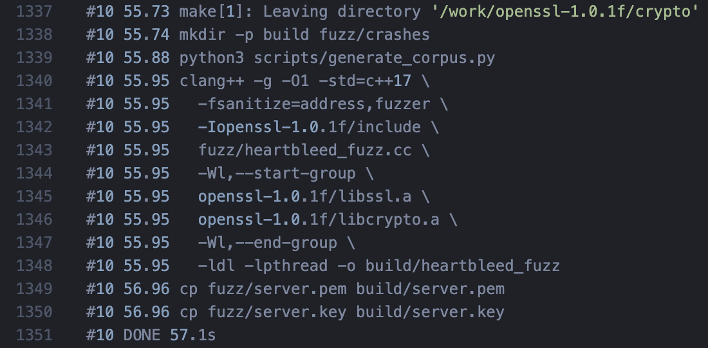
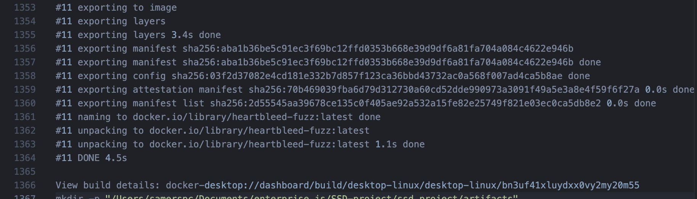
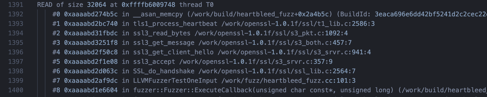
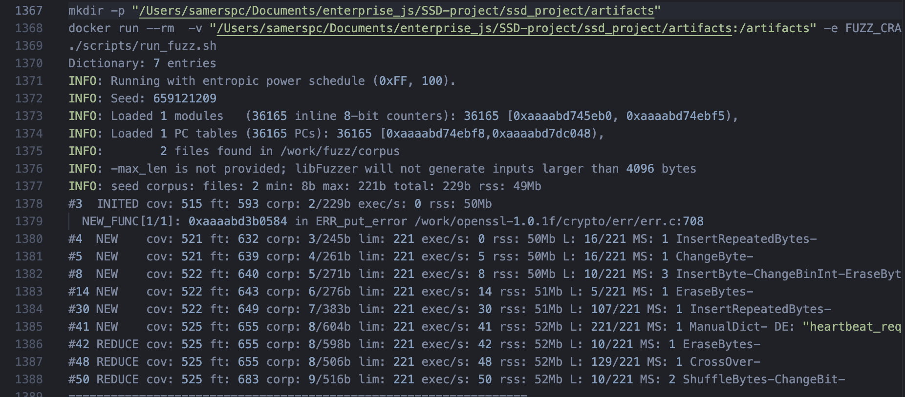
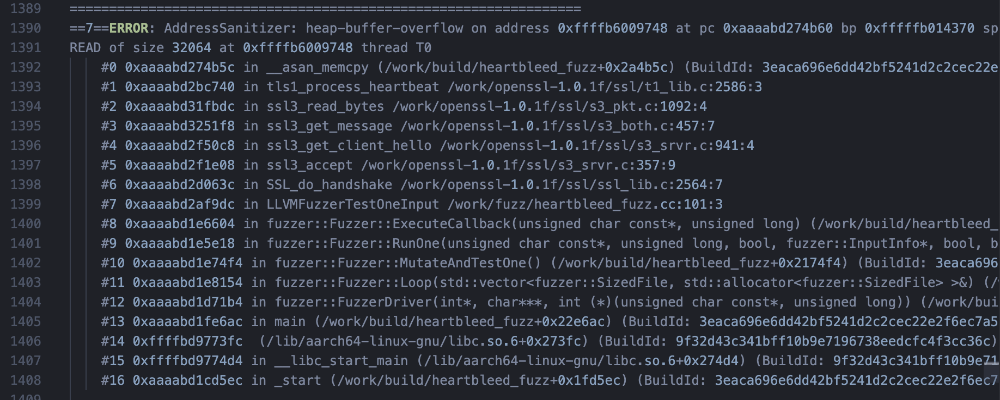
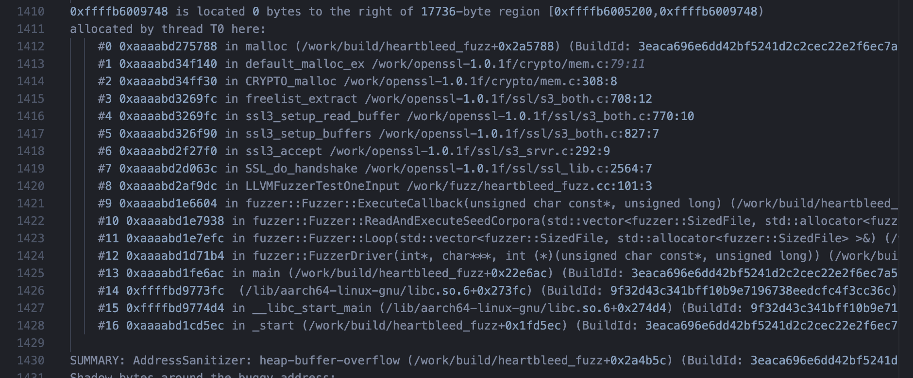
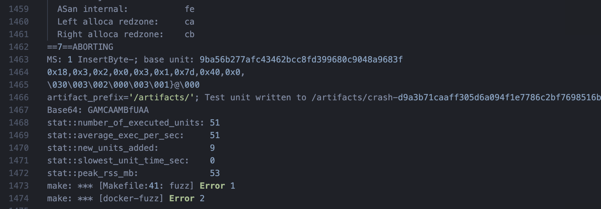

# Report: Rediscovering Heartbleed (CVE-2014-0160) with libFuzzer

### Samat Iakupov, Dmitrii Antipov, Mark Petrov

**Where the screenshots come from:** the log file **`demo/fuzz-demo.log`** (full output of one `make docker-fuzz` run with `tee`; this file has **1475 lines**). For each figure below we give **line numbers in that file**. Turn on line numbers in your editor and copy the range we give. If you record a new log, line numbers may move—find the same text using the figure captions.

---

## 1. Abstract

This is a course-style **fuzzing** project. The goal was to **find again a known bug**: **CVE-2014-0160 (Heartbleed)** in **OpenSSL 1.0.1f**. We used **libFuzzer** and **AddressSanitizer (ASan)** inside **Docker** (Ubuntu 22.04, clang). Random bytes go into a TLS **server** context through in-memory BIOs. When the parser hits the bad heartbeat path, ASan reports a **heap-buffer-overflow** with a stack frame in **`tls1_process_heartbeat`** (`ssl/t1_lib.c`). libFuzzer saves the input as a **crash file**; you can **replay** it by running the fuzzer binary on that file.

---

## 2. Task and choices

**Task:** pick a fuzzing tool from the allowed list (libFuzzer, AFL++, Google FuzzTest), run it, and show **rediscovery** of a known CVE on a **vulnerable** build.

**Why this CVE:** CVE-2014-0160 is famous, well documented, and there are public examples (including ClusterFuzz).

**Why this tool:** **libFuzzer + ASan** gives fast in-process fuzzing, one instrumented binary, and works well with clang in the container.

---

## 3. How we built the project (step by step)

1. **Read about the CVE.** Heartbleed is a bad TLS Heartbeat handler: the code trusts the **length** field in the message without checking that the message really contains that many bytes. Then it **reads past the end** of the buffer.

2. **Pick a target.** We pinned **OpenSSL 1.0.1f** (still vulnerable; fixed in 1.0.1g).

3. **Repo layout.** We added:
   - `Dockerfile` — base image, packages, build OpenSSL + fuzz target during `docker build`;
   - `Makefile` — targets `build`, `fuzz-build`, `fuzz`, `reproduce`, `docker-fuzz`, `docker-reproduce`;
   - `scripts/build_openssl.sh` — download source tarball, build static `libssl.a` / `libcrypto.a` with ASan and `fuzzer-no-link`;
   - `fuzz/heartbleed_fuzz.cc` — harness with `LLVMFuzzerTestOneInput`, TLS server, `SSL_do_handshake` / `SSL_read`;
   - `scripts/run_fuzz.sh` — run libFuzzer with corpus + dictionary;
   - `scripts/generate_corpus.py` — write starter seed files;
   - `fuzz/heartbleed.dict` — byte tokens for TLS / heartbeat.

4. **First Docker run.** We used `make docker-fuzz` to build the image and start fuzzing.

5. **Fix a link error.** On some setups, linking `heartbleed_fuzz` with static `libssl.a` and `libcrypto.a` failed with many **`undefined reference`** errors to symbols that live in `libcrypto`. Fix: wrap both archives in **`-Wl,--start-group` … `-Wl,--end-group`** in the `Makefile` so the linker can resolve symbols across the static libs.

6. **Small script hardening (quality).**
   - `build_openssl.sh`: fail clearly if download fails; check the archive is non-empty; check **SHA256** of the tarball (override with `OPENSSL_TARBALL_SHA256` if needed); use `sha256sum` or `shasum` depending on the OS;
   - `reproduce.sh`: if no crash path is passed, pick the **newest** `crash-*` file by time, not the first name in alphabetical order.

7. **Final run.** After the image built, we ran `make docker-fuzz` and saved the output with `tee demo/fuzz-demo.log` for the report and demo.

8. **Replay check.** `make docker-reproduce` replays a crash from `artifacts/` and should show the same ASan report. You can save that output to e.g. `demo/reproduce-demo.log` and cite line ranges the same way.

---

## 4. Repository layout (short)

| Path | Role |
|------|------|
| `Dockerfile` | Image with toolchain; prebuilds OpenSSL + fuzz target |
| `Makefile` | Build and run (local or Docker) |
| `fuzz/heartbleed_fuzz.cc` | Fuzz harness (libFuzzer entry) |
| `fuzz/corpus/` | Starter corpus (created at build time) |
| `fuzz/heartbleed.dict` | libFuzzer dictionary |
| `scripts/build_openssl.sh` | Download and build OpenSSL 1.0.1f |
| `scripts/run_fuzz.sh` | libFuzzer flags (`-dict`, `-max_total_time`, `artifact_prefix`) |
| `scripts/reproduce.sh` | Replay one saved crash file |
| `artifacts/` | On the host: mounted volume with `crash-*` from the container |
| `demo/fuzz-demo.log` | Full run log for the report and figures |

**Optional figure (not from the log).** Screenshot of `ls -la artifacts/` on the host so the `crash-<sha>` file is visible.


---

## 5. Building OpenSSL and the fuzzer

**OpenSSL** is built as **static** libs (`no-shared`) with:

- `-fsanitize=address,fuzzer-no-link` — instrument the libs for ASan and for linking with the fuzzer, without linking the fuzzer runtime into the library itself.

**Fuzzer** is a separate `clang++` binary with `-fsanitize=address,fuzzer` and static `libssl.a` / `libcrypto.a` inside a **link group** (see below).

Snippet from the `Makefile` (main part):

```makefile
clang++ -g -O1 -std=c++17 \
  -fsanitize=address,fuzzer \
  -I$(OPENSSL_DIR)/include \
  fuzz/heartbleed_fuzz.cc \
  -Wl,--start-group \
  $(OPENSSL_DIR)/libssl.a \
  $(OPENSSL_DIR)/libcrypto.a \
  -Wl,--end-group \
  -ldl -lpthread -o $(FUZZER)
```

To check “build works and we hunt the bug”:

```bash
make docker-fuzz
```

The command should end with a **non-zero exit code**: when ASan finds a bug it **aborts** the process. That is **not** a failed build; it means the sanitizer fired.

**Figure 1.** Part of the log from the `docker build` step: corpus generation, the `clang++` link line for `heartbleed_fuzz` with `-Wl,--start-group` / `--end-group`, copy of certs, end of layer `#10 DONE`.

- **File:** `demo/fuzz-demo.log`
- **Lines:** **1337–1351** (from `mkdir -p build` / `python3 scripts/generate_corpus.py` through `#10 DONE 57.1s`)



**Figure 2.** Docker exports the image and tags `heartbleed-fuzz:latest` — proof the image built before `docker run`.

- **File:** `demo/fuzz-demo.log`
- **Lines:** **1353–1366** (from `#11 exporting to image` through the `View build details:` line)



---

## 6. Harness (what we actually fuzz)

Harness (`fuzz/heartbleed_fuzz.cc`):

1. `LLVMFuzzerInitialize` stores the directory of the executable (to load `server.pem` / `server.key` next to the binary in `build/`).
2. Once: create server `SSL_CTX` for TLSv1 and load the test certificate.
3. In **`LLVMFuzzerTestOneInput`** for each input:
   - create `SSL*`, in/out **memory BIOs**;
   - write fuzz bytes into the inbound BIO;
   - call **`SSL_do_handshake`**, then loop **`SSL_read`** to drain records.

So OpenSSL treats the bytes as TLS server traffic; with the right mutation, control reaches the heartbeat handler and the **1.0.1f** bug triggers.

**Figure 3.** Stack snippet at crash time: the path goes from **`LLVMFuzzerTestOneInput`** (`heartbleed_fuzz.cc:101`) through **`SSL_do_handshake`** into OpenSSL—so the harness really drives the TLS stack.

- **File:** `demo/fuzz-demo.log`
- **Lines:** **1392–1400** (from `#0 __asan_memcpy` through `#7 ... LLVMFuzzerTestOneInput ... heartbleed_fuzz.cc:101`)



---

## 7. Corpus and dictionary

- **Seeds:** a small heartbeat-like record and a larger ClientHello-like blob (`scripts/generate_corpus.py`) — they help the fuzzer reach “TLS-shaped” data faster.
- **Dictionary** (`heartbleed.dict`): heartbeat type `0x18`, TLS version bytes, handshake prefixes — helps mutations hit the right format sooner.

**Figure 4.** Fuzzer startup: `docker run`, `./scripts/run_fuzz.sh`, `Dictionary:`, corpus info (`2 files`, seed sizes), libFuzzer `INFO` lines and a few mutation lines right **before** the ASan banner (you can see dictionary use, e.g. `ManualDict` / `heartbeat_request`).

- **File:** `demo/fuzz-demo.log`
- **Lines:** **1367–1388** (from `mkdir -p ".../artifacts"` / `docker run` through the `#50 REDUCE` line, the last line before the `=================================================================` banner)

*Note: In the log file this block appears **before** the stack in Figure 3, because it is earlier in the same run.*



---

## 8. Fuzzing run — what we saw

**Command:** `make docker-fuzz` (inside: `docker run` with `artifacts/` mounted, then `make fuzz` → `scripts/run_fuzz.sh`).

**On a good run:**

- libFuzzer loads corpus + dictionary (`Dictionary: … entries`);
- coverage grows (`NEW`, `REDUCE`, `cov` / `ft`);
- ASan prints **`heap-buffer-overflow`**;
- stack shows **`tls1_process_heartbeat`** and **`ssl/t1_lib.c:2586`**;
- libFuzzer writes **`Test unit written to /artifacts/crash-<sha>`**;
- `make` fails with **`ABORTING`** — that is **expected**.

**Figure 5.** Main proof: ASan header, error type, stack with **`tls1_process_heartbeat`** and **`t1_lib.c:2586`**.

- **File:** `demo/fuzz-demo.log`
- **Lines:** **1389–1408** (from the `====` line and `ERROR: AddressSanitizer` through frame `#16 _start`)



**Figure 6.** Memory context: heap region text, **allocation** stack (`CRYPTO_malloc`, `ssl3_setup_read_buffer`, …), and the **`SUMMARY: AddressSanitizer`** line.

- **File:** `demo/fuzz-demo.log`
- **Lines:** **1410–1430** (from `0xffff... is located` through `SUMMARY: AddressSanitizer: heap-buffer-overflow ...`)



**Figure 7.** End of run: **`ABORTING`**, hex dump of the triggering input, **crash file path**, libFuzzer stats, **`make: *** [fuzz] Error 1`**. In the caption, state clearly: **a non-zero `make` exit here means success** (the process was stopped on purpose by ASan).

- **File:** `demo/fuzz-demo.log`
- **Lines:** **1459–1474** (from `==7==ABORTING` through `make: *** [docker-fuzz] Error 2`)



**Replay:**

```bash
make docker-reproduce
```

This runs the fuzzer on the saved file under `artifacts/`; you should see the same error class and the same code path.

**Figure 8 (optional).** Screenshot from a separate log, e.g. `make docker-reproduce 2>&1 | tee demo/reproduce-demo.log` — again `AddressSanitizer` and `tls1_process_heartbeat`. Line numbers depend on output length; crop from `Running:` / `ERROR: AddressSanitizer` through `ABORTING`.

---

## 9. Mapping the crash to CVE-2014-0160

- **Version:** OpenSSL 1.0.1f is in the vulnerable range before 1.0.1g.
- **Mechanism:** out-of-bounds **read** while handling heartbeat (Figures **5–6** show `heap-buffer-overflow` / read in `__asan_memcpy` from `tls1_process_heartbeat`).
- **Code location:** `tls1_process_heartbeat` is the documented Heartbleed site.
- **Replay:** the same input crashes again (Figure **7** — saved `crash-*`; Figure **8** — optional replay log).

That is the assignment’s “rediscover a known CVE with fuzzing,” not a random unrelated crash.

---

## 10. Patch (reference only)

Upstream fix: commit `96db9023b881d7cd9f379b0c154650d6c108e9a3` — adds bounds checks before copying the claimed heartbeat payload; bad messages are dropped per RFC 6520.

---

## 11. Conclusions

- A small **harness** around a real library lets libFuzzer quickly hit “wrong trust in length fields” style protocol bugs.
- **ASan** turns an out-of-bounds **read** into a loud failure with a stack—without it, Heartbleed would stay a quiet memory leak.
- **Docker** pins OS and compiler and makes grading / reproduction easier.
- Static OpenSSL needed careful **archive order / link group** settings for the fuzz target.

---

## 12. Quick table: figure → section → lines in `demo/fuzz-demo.log`

| Figure | Report section | Lines in `demo/fuzz-demo.log` |
|--------|----------------|------------------------------|
| Fig. 1 | §5 Build | **1337–1351** |
| Fig. 2 | §5 Build | **1353–1366** |
| Fig. 3 | §6 Harness | **1392–1400** |
| Fig. 4 | §7 Corpus & dictionary | **1367–1388** |
| Fig. 5 | §8 Results | **1389–1408** |
| Fig. 6 | §8 Results | **1410–1430** |
| Fig. 7 | §8 Results | **1459–1474** |
| Fig. 8 | §8 (optional) | separate file `reproduce-demo.log` |

---

## 13. References

1. CVE-2014-0160 (MITRE/NVD): https://cve.mitre.org/cgi-bin/cvename.cgi?name=CVE-2014-0160  
2. OpenSSL security advisory (2014-04-07): https://www.openssl.org/news/secadv/20140407.txt  
3. Fix commit: https://github.com/openssl/openssl/commit/96db9023b881d7cd9f379b0c154650d6c108e9a3  
4. ClusterFuzz Heartbleed example: https://google.github.io/clusterfuzz/setting-up-fuzzing/heartbleed-example/  
5. OpenSSL 1.0.1 source archive: https://www.openssl.org/source/old/1.0.1/
